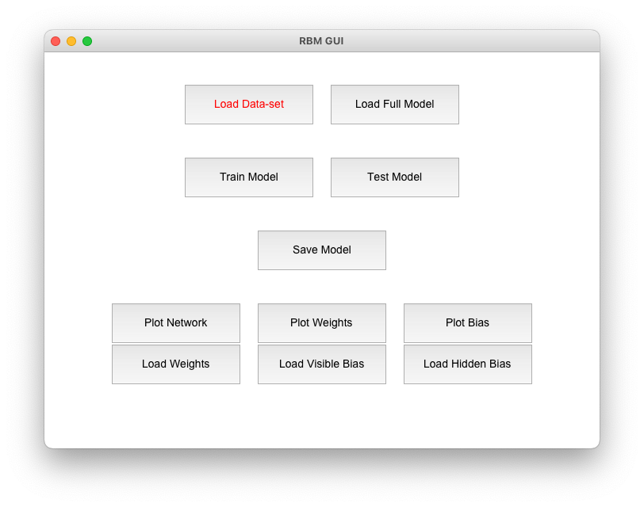
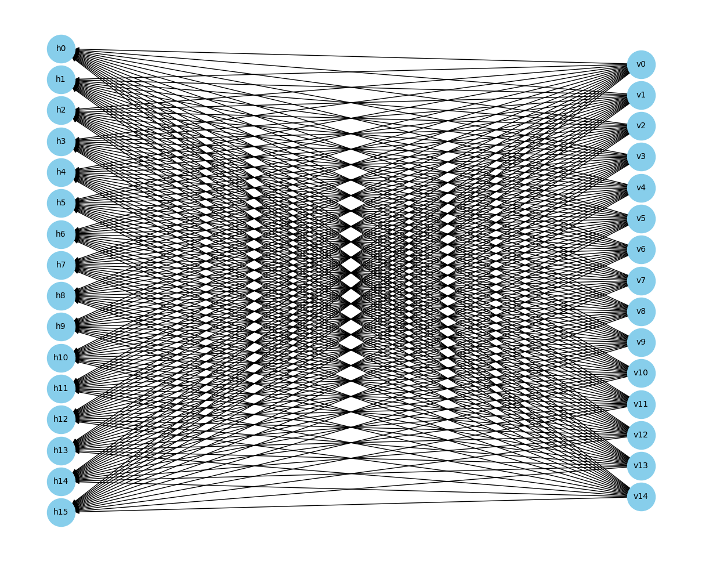
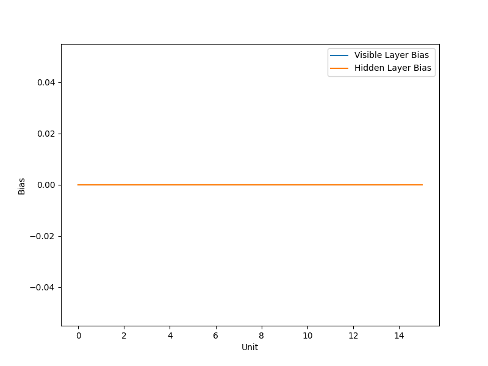
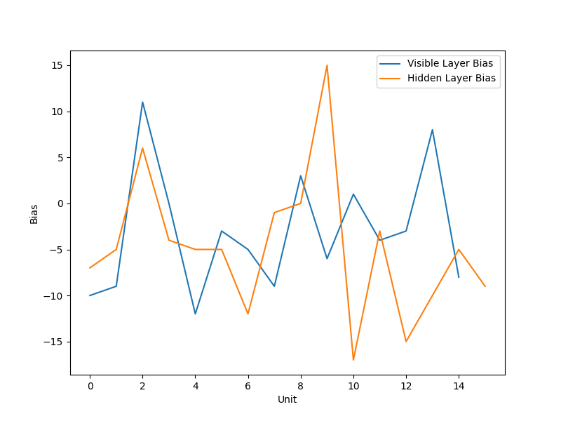
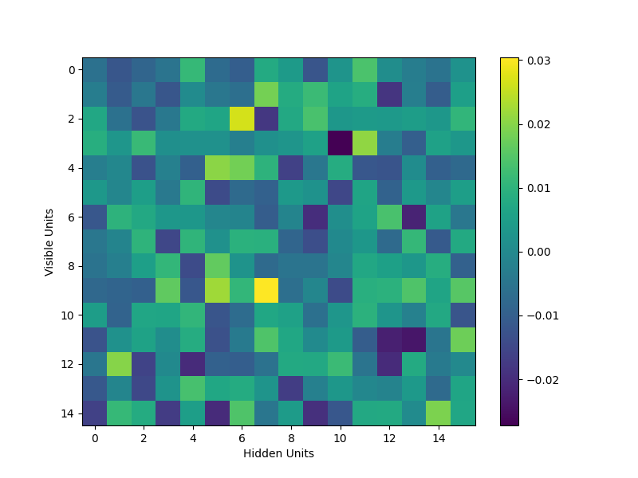
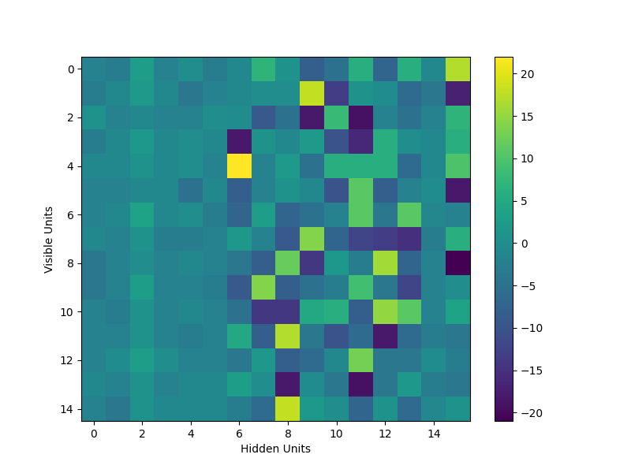

# Restricted Boltzmann Machine (RBM) 🧠

Welcome to my **Restricted Boltzmann Machine (RBM)** project, a key part of the **CA 20581 Biological Computation** course, 2024a, at *the Open University of Israel*. This project delves into the generative stochastic neural networks, aiming to learn complex probability distributions from input data.

<p align="center">
  
</p>

---

<!-- @import "[TOC]" {cmd="toc" depthFrom=2 depthTo=3 orderedList=false} -->

<!-- code_chunk_output -->

- [Project Overview 📜](#project-overview-)
  - [Background](#background)
  - [Features](#features)
- [Getting Started 🚀](#getting-started-)
  - [Command-Line Interface ⌨️](#command-line-interface-️)
  - [GUI Interface 🖥️](#gui-interface-️)
- [RBM Core Architecture 🏗️](#rbm-core-architecture-️)
  - [Component Overview](#component-overview)
  - [Network Design](#network-design)
  - [Layer Classes and Hierarchy](#layer-classes-and-hierarchy)
  - [Network Structure Illustration](#network-structure-illustration)
  - [Important Note](#important-note)
  - [Energy function](#energy-function)
  - [Initialization Process](#initialization-process)
- [Utilizing the Network](#utilizing-the-network)
  - [Evaluating the Model](#evaluating-the-model)
  - [Initial Observations](#initial-observations)
  - [Understanding the Outcomes](#understanding-the-outcomes)
- [Contributing to the Project 💡](#contributing-to-the-project-)

<!-- /code_chunk_output -->

---

## Project Overview 📜

### Background

Restricted Boltzmann Machines (RBMs) are generative stochastic neural networks adept at learning probability distributions over input sets. Featuring both visible and hidden units with undirected connections, RBMs harness the contrastive divergence algorithm for efficient parameter optimization.

This RBM implementation stems from a Biological Computation course at the Open University of Israel, designed to delve into generative learning's nuances and RBMs' application in machine learning and AI. Remarkably, this project foregoes external libraries, utilizing only Python and NumPy to construct the RBM and its components.

The project leverages the Iris dataset, a staple in machine learning for its detailed feature set of iris flower species, to train the RBM in classifying iris flowers, showcasing the model's prowess in learning complex distributions and executing classification tasks. Additionally, a GUI application enhances user engagement with the RBM, offering an intuitive interface for dataset interaction.

### Features

This RBM project encompasses a suite of features to navigate the intricacies of generative learning and neural networks:

- **Customizable Hidden Units:** Adapt the RBM with varying hidden unit counts to accommodate different datasets and learning challenges.
- **Efficient Learning with Contrastive Divergence:** Employ this cutting-edge algorithm for streamlined learning and model refinement.
- **Robust Model State Management:** Effortlessly manage the model's weights, biases, and settings, facilitating continuity in projects or analyses.
- **Insightful Visualizations:** Gain a deeper understanding of the model through comprehensive visualization tools that illustrate the network's structure, weights, biases, and learning evolution.
- **Interactive User Experience:** Engage with the RBM via a polished GUI or command-line interface, designed for ease of data management, model training, and evaluation.
- **Advanced Data Preprocessing:** Utilize the `DataSet` class for proficient dataset management, ensuring smooth integration with the RBM's generative learning requirements.

---

## Getting Started 🚀

Interacting with the RBM model is streamlined through both a command-line interface and a GUI application, offering varied functionalities for model training, evaluation, and visualization.

### Command-Line Interface ⌨️

Navigate the RBM model with these command-line flags for a tailored interaction:

- `-train`: Initiates model training with designated or default settings.
- `-test`: Evaluates the model's accuracy on a given dataset.
- `-plot`: Visualizes the model's structure, weights, and biases.
- `-save`: Archives the model's weights and biases for future use.
- `-load`: Restores the model's weights and biases from saved files.

#### Example Command 📌

To train the model, and then save the weights:

```bash
python rbm.py -train -save
```

To load an existing model and test its performance:

```bash
python rbm.py -load -test
```

### GUI Interface 🖥️

To enhance user interaction and simplify the process of managing the RBM, this project includes a GUI application built with Tkinter. The GUI provides an intuitive interface for performing key operations such as data loading, model training/testing, and visualization.

From the GUI, you can load the dataset, train the network, test the network, and plot the synapses and biases of the network. I tried to make it friendly and easy to use. Make sure to load the dataset before training or testing the network, a file dialog will open when you click the `Load` button. The [iris.data](iris.data) file is included in the repository.



---

## RBM Core Architecture 🏗️

This section outlines the core components of the Restricted Boltzmann Machine (RBM) network, implemented in Python. The architecture is modular, designed for flexibility across various datasets, with specific optimization for the Iris dataset.

### Component Overview

- **[DataSet.py](DataSet.py)**: Defines the `DataSet` class, responsible for loading and parsing datasets into numpy arrays of discrete values, tailored for RBM processing.
- **[RBM.py](RBM.py)**: Introduces the `RBM` class, embodying the core functionality of the RBM network, including training and sampling methods. This file also contains the `Synapse` class, which is currently under review for removal due to potential redundancy.
- **[GUI.py](GUI.py)**: Implements a graphical user interface (`GUI` class) to facilitate user interaction with the RBM network.
- **[layers.py](layers.py)**: Contains the `Layer` class, representing individual layers within the RBM. This class is crucial for managing neuron states, biases, and potentially enabling parallel processing within the network. The structure aims to highlight network restrictions and enhance modularity.

### Network Design

The RBM is configured for the Iris dataset as follows:

- **Input Neurons**: 12 neurons, allocated as 3 per each of the 4 dataset features, post-normalization to discrete values.
- **Output Neurons**: 3 neurons, one per dataset class.
- **Hidden Neurons**: 16 neurons, an empirically determined number based on experimental outcomes.

Note that the input and output neuron are the `visible units` ( $\vec{v} = (v_1,...,v_{n=15})$ ) and the `hidden units` are the hidden neurons ( $\vec{h} = (h_1,...,h_{m=16})$ ).

### Layer Classes and Hierarchy

The network employs two primary layer types, managed through inheritance:

- **`Layer`**: A generic class for RBM layers, managing units (neurons) and biases. It serves as the foundation for:
  - **`HiddenLayer`** and **`VisibleLayer`**: Specialized classes derived from `Layer`, tailored to their specific roles in the network structure.

### Network Structure Illustration



The diagram details the network's composition, including hidden neurons ($h_0$ to $h_{15}$), input neurons ($v_0$ to $v_{11}$), and output neurons ($v_{12}$ to $y_{14}$), with 0-based indexing for clarity and consistency.

### Important Note

An indexing discrepancy led to a significant bug affecting class classification accuracy. The issue, stemming from a mix of 1-based and 0-based indexing, primarily impacted the third class's recognition. This has been rectified to ensure consistent and accurate network performance.

### Energy function

```python
def energy(self, visible_units, hidden_units):
    """
    calculate the energy of the model using the formula:
    -Σ(vi * a) - Σ(hj * b) - Σ(Σ(vi * wji) * hj)
    args:
    - visible_units: the visible layer units
    - hidden_units: the hidden layer units
    """
    visible_bias = self.visible_layer.bias
    hidden_bias = self.hidden_layer.bias
    weights = self.synapses.weights
    return -np.dot(visible_bias, visible_units)\
        - np.dot(hidden_bias, hidden_units) - \
        np.dot(visible_units.T @ weights,
               hidden_units)  # note the @ operator
```

The energy function of the network is thus:

$E(\vec{v}, \vec{h}) = -\sum_{i=1}^{15} v_i a_i - \sum_{j=1}^{16} h_j b_j - \sum_{i=1}^{15} \sum_{j=1}^{16} J_{ij} v_i h_j$

Where:

### Initialization Process

#### Data Handling with DataSet Class

The `DataSet` class serves as the cornerstone for data management within the RBM framework. It is engineered to streamline the loading, preprocessing, and handling of datasets, ensuring seamless compatibility with the RBM's operational requirements.

Key Features:

- **Instance Management**: Facilitates the encapsulation of data entries through the `Instance` object, streamlining data manipulation and access.
- **Discrete Value Transformation**: Employs a method to convert continuous attributes into discrete values, optimizing data for the RBM's generative learning process.
- **Adaptable Data Processing**: Supports dynamic integration of labels, attributes, and instances, catering to diverse dataset structures.
- **Efficient Data Loading**: Implements the `createDataSet` method for direct file-based data initialization, accommodating real values that are discretized as necessary.

##### Operational Workflow

1. **Setup**: Initiates with an empty framework for labels, attributes, and instances.
2. **Data Ingestion**: Utilizes file input to populate the model with relevant data, identifying and storing components via specialized methods.
3. **Data Conversion**: Applies the `convertToDiscrete` method to continuous values, preparing the dataset for RBM training.

#### Synaptic Initialization

Before runing the classification the following steps must preceed:

1. Define the energy function with suitable parameters.
2. Lock the input units as required.
3. Initialize the other units with random values, and choose big $T$ to allow the network to converge.

The synapses and biases are initialized using the `train` method, which is called from the `RBM` class. The process is as follows:

1. **Synaptic Initialization**: The weights and biases are initialized using a random number generator from the numpy library, with values ranging between -0.1 and 0.1, laying the foundation for diverse neural connections.
2. **Choose the learning rate**: The learning rate is set to 0.1, a value that has been empirically determined to facilitate efficient learning and convergence.

Than the following steps are reapeated until the network converges, or until a maximum number of iterations is reached:

1. Pick a random instance $\vec{v} = (v_1,...,v_15)$ from the dataset.

2. Calculate the probability $P_k$ for every hidden unit $h_k$ using the formula: $P_k = \frac{1}{1 + e^{-\sum_{i=1}^{15} v_i w_{ik} - b_k}}$. Note that that it doesnt deapend on the other hidden units - this is the reason for the name `Restricted` Boltzmann Machine, and also why it enables parallel processing.

3. Initialize the classification algorithm with $\vec{v} = (v_1,...,v_{15})$ and perform a single step of the Gibbs sampling algorithm to get network state $(\vec{h}(1), \vec{v}(1))$. This is done without locking the input units.

4. Update the weights and biases using the contrastive divergence algorithm:
   - $a_i^{new} = a_i + \eta(v_i - v_i{(1)})$
   - $b_j^{new} = b_j + \eta(P_j - h_j{(1)})$
   - $J_{ij}^{new} = J_{ij} + \eta(v_i P_j - v_i{(1)} h_j{(1)})$

5. Repeat the previous steps until the network converges, or until a maximum number of iterations is reached.

## Utilizing the Network

### Evaluating the Model

- **Pre-training Evaluation**: Utilize the GUI or modify `CONSOLE_LOGGING` in `RBM.py` to `True` for insights into the network's initial state.
- **Training Execution**: Initiate the learning process via GUI or command line, employing the `test` function.

### Initial Observations

Post-training, the network exhibits around 90% accuracy on the test set, demonstrating stable performance and precise classification across multiple iterations. For custom runs, leverage the `load` argument or the GUI to input predefined biases and weights.

### Understanding the Outcomes

The evolution of biases and synapses post-learning is visually represented, indicating convergence towards optimal values and illustrating the learning impact.

| Condition | Before Learning | After Learning |
|-----------|-----------------|----------------|
| Biases    |  |  |
| Synapses  |  |  |

## Contributing to the Project 💡

Your expertise can significantly propel this project forward. We invite contributions in all forms, from code enhancements to feedback. Join us in refining and expanding the capabilities of this RBM implementation.
